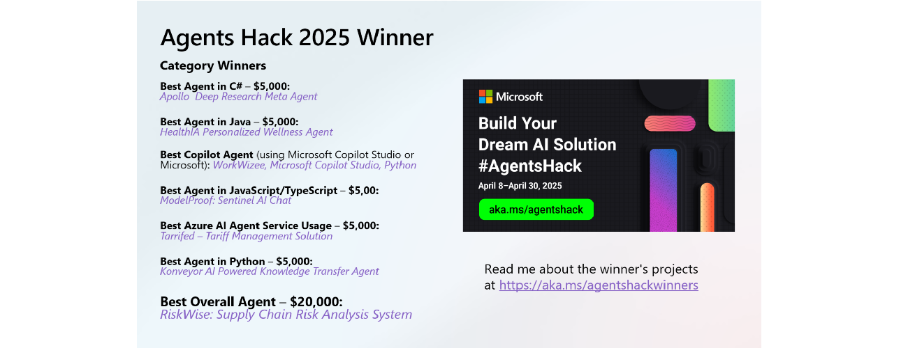
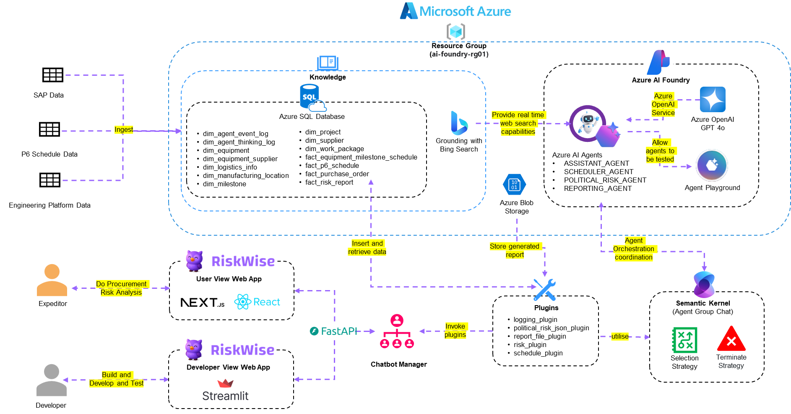
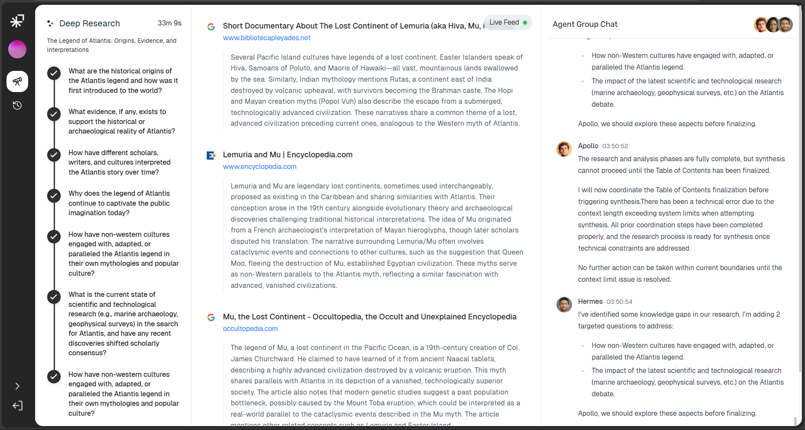
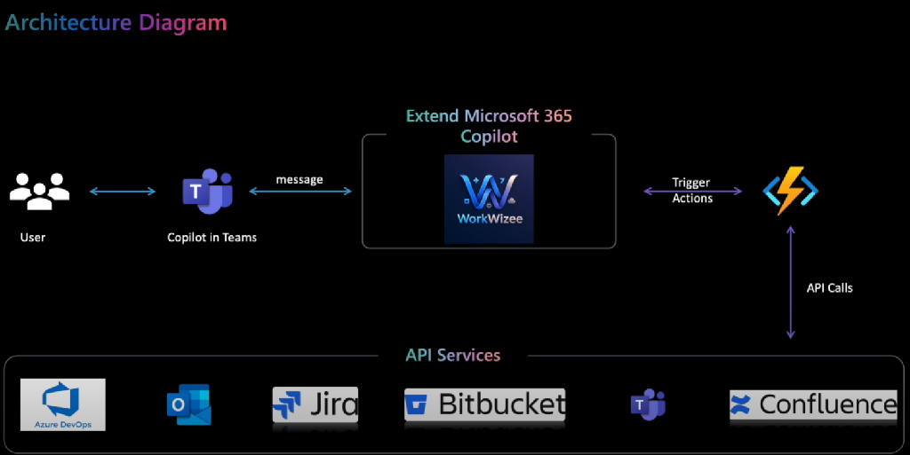
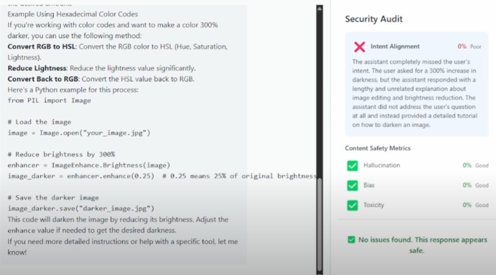

---
hide:
  - navigation
---

# AI Agents Hackathon 2025 – Category Winners Showcase

**2025 is the year of AI agents, and the recent AI Agents Hackathon proved it in style.**

This free, three-week virtual hackathon (April 8–30, 2025) brought together developers worldwide to build innovative AI agent solutions. Participants had access to over 20 expert-led sessions on frameworks like Semantic Kernel, Autogen, the new Azure AI Agents SDK, and Microsoft 365 Copilot SDK.

The response was tremendous with over **18,000 developers registered and 570 project submissions** spanning diverse use cases. Projects were judged on innovation, impact, usability, solution quality, and category alignment, across multiple award categories (Best Overall, Python, C#, Java, JavaScript/TypeScript, Copilot, and Best use of Azure AI Agent Service).

The results are in! Below we highlight the standout winners in each category—the creativity and technical prowess on display are truly inspiring.

## 🏆 Best Overall Winner – RiskWise: Supply Chain Risk Analysis System

**RiskWise** emerged as the Best Overall winner with its innovative approach to **supply chain risk analysis**.

Built using **Python** (for AI logic), a **React/Next.js** front-end, **Azure AI Agent Service**, **Semantic Kernel**, and **SQL** for data, RiskWise showcases end-to-end excellence. The project tackles the complex problem of identifying and analyzing risks in global supply chains. By leveraging AI agents, RiskWise can sift through vast amounts of supply chain data (e.g. shipping schedules, news about trade disruptions, etc.) to **flag potential risks** – from port delays to geopolitical events – that might impact production or delivery. It likely uses Semantic Kernel to plan and orchestrate calls to various tools or data sources, and Azure AI Agent Service to integrate advanced language models for understanding queries. The **user interface** built in Next.js allows analysts to query the system in natural language and visualize risk insights. In short, RiskWise helps businesses **anticipate supply disruptions** and make informed decisions in real-time, which is a game-changer for operational resilience.

**Technologies:** Python, React/Next.js, Azure AI Agent Service, Semantic Kernel, SQL  
[Learn more: Project Issue #526 (GitHub)](https://github.com/microsoft/AI_Agents_Hackathon/issues/526)

## 🥇 Best C# Agent – "Apollo" – Deep Research Meta Agent

**Apollo** is an AI agent that acts as a **deep research assistant**, capable of transforming complex queries into comprehensive research reports. Written in C# on the backend (ASP.NET Core) with a React frontend, Apollo orchestrates multiple specialized sub-agents to collaborate on answering a query.

Its architecture is particularly impressive:

- **Multi-agent orchestration:** Apollo the coordinator manages two expert agents – *Athena*, the research engine, and *Hermes*, the analyzer. Using Semantic Kernel's AI orchestration, these agents work together in a group chat to tackle different aspects of a research task.
- **Self-reflective RAG (Retrieval-Augmented Generation):** Apollo performs iterative information gathering and checks for knowledge gaps using a vector memory (PostgreSQL/pgvector). It retrieves relevant web content (via an agent using Bing/Exa AI search) and stores it, then Hermes analyzes completeness and identifies missing pieces.
- **Two-stage synthesis:** The system first generates section-specific content and then synthesizes a final, well-structured report with proper citations.
- **State machine & async workflow:** A state machine architecture allows Apollo to maintain context across steps outside a single chat session, and an asynchronous event pipeline ensures the complex research process is handled efficiently.

Using **Azure AI Agent Service** and Azure OpenAI (GPT-4), Apollo can answer, for example, *"Analyze the impacts of climate change on global agriculture"* by breaking it down into subtopics, researching each, and compiling an in-depth report. This project brilliantly demonstrates how C# and .NET can be used with Semantic Kernel to coordinate multiple AI agents in a sophisticated workflow. The result is a **research meta-agent** that could save users countless hours in gathering and summarizing information.

**Technologies:** C# (.NET 7/ASP​.NET Core), Semantic Kernel, Azure AI Agents Service (with GPT-4), React (frontend), PostgreSQL (vector DB)  
[Learn more: Apollo – Deep Research Meta Agent (#681)](https://github.com/microsoft/AI_Agents_Hackathon/issues/681)

# 🥇 Best Java Agent – Bit2Brain: Personalized Wellness Agent

Bits2Brain is an AI-powered system designed to capture and connect fragmented information, turning everyday learning moments into an evolving **Knowledge Star Map**. Whether it's a tip from a video, a breakthrough in tech news, or an insightful article, the platform enables users to store, structure, and visualize their knowledge in an interactive way.

## Core Features
1. **Knowledge Star Map Generation** – Users can upload snippets of knowledge (links, videos, screenshots), with AI automatically identifying connections between related nodes.  
2. **Node Expansion & Cognitive Completion** – AI suggests relevant topics and additional knowledge nodes based on context, allowing users to explore and grow their understanding.  
3. **Knowledge Fusion & Summarization** – Related nodes can be merged into a refined summary, compressing information while maintaining key connections and resources.  
4. **Multimodal Input Support** – Supports various formats, including text, images, and videos, with AI-powered analysis tools (OCR, video indexing) to extract meaningful data.  
5. **Conversational AI with Agent System** – Users interact with an AI Agent to ask questions, receive video recommendations, and navigate their personalized knowledge graph.

## Who is it for?
Students, researchers, content creators, and professionals looking to organize scattered knowledge, track inspiration, and build mental models for learning.

Ultimately, Bits2Brain aims to combat information overload by turning passive learning into structured, dynamic, and interactive knowledge growth powered by AI.

**Technologies** Langchain4j, Azure Video Indexer, Azure Computer Vision, Neo4j, Java, JavaScript.

[Learn more: Bits2Brain (#638)](https://github.com/microsoft/AI_Agents_Hackathon/issues/638)

## 🥇 Best Copilot Agent – WorkWizee

**WorkWizee** won the Copilots category by addressing a common corporate challenge: **managing P1/P2 incident calls**. These calls often involve multiple updates across Jira, ServiceNow, and Confluence, alongside notifying managers and teams. The goal? Automating these repetitive tasks with an intelligent agent integrated within Microsoft Teams—allowing developers to focus on fixing bugs instead of juggling updates.

WorkWizee enables seamless, natural language interactions to handle workflow tasks. Instead of manually updating Jira tickets or sending notifications, users can simply type commands like:

> "Add the workflow is working now comment to WOWZEE-12 Jira ticket."

The agent processes the request and executes the necessary API calls, eliminating tedious steps.

### Key Features

- **Microsoft Teams**
  - Create groups with active users
  - Send reminders to multiple users
  - Direct message designated responders
- **Jira**
  - Create and assign Jira tickets dynamically
  - Comment on tickets
  - Retrieve the latest comments
- **Bitbucket**
  - Create pull requests (PRs) for various branches
  - Retrieve prioritized open PRs
  - Comment on PRs and notify users via Teams

### Technology Stack

- **Copilot Studio** – Bot development & automation
- **Python** – Backend API logic
- **Azure Functions** – Scalable & cost-effective API hosting
- **Jira API, BitBucket API, Confluence API, Outlook API** – Handling integrations with corresponding platforms

WorkWizee improves team efficiency by cutting down the manual workload, saving up to 40% of time spent on incident management. It transforms reactive operations into proactive automation—getting teams back to coding faster.

**Technologies:** Microsoft 365 Copilot Studio, Python, Azure Functions, Jira API, BitBucket API  
[Learn more: WorkWizee – Issue #587](https://github.com/microsoft/AI_Agents_Hackathon/issues/587)

## 🥇 Best JavaScript/TypeScript Agent – ModelProof: Sentinel AI Chat

**ModelProof: Sentinel AI Chat** took the JS/TS category by demonstrating how to make AI outputs more **trustworthy and transparent**. In an era concerned with AI hallucinations and bias, ModelProof acts as a **sentinel guard** for AI-generated answers.

- **Dual-LM consistency check:** ModelProof runs two large language models in parallel for each user query and compares their responses [https://www.youtube.com/watch?v=qPX_TDM4DSE](https://www.youtube.com/watch?v=qPX_TDM4DSE). The idea is that if both models agree on an answer, confidence in correctness is higher – and if they differ, that's a flag for potential issues. For example, it might query both GPT-4 and another model, and then automatically cross-verify the outputs.
- **Real-time auditing for safety:** Every answer is audited in real-time for **hallucinations, bias, toxicity, and intent alignment**. The agent uses content moderation and evaluation techniques (likely via Azure AI Content Safety or custom prompts) to detect if the response contains made-up facts, overly biased statements, or unsafe content.
- **Clear "risk insight" reporting:** ModelProof doesn't just give the user an answer – it gives a confidence or risk report. If there were discrepancies between the two models or any red flags (say, one model produced a potentially toxic sentence), the agent will highlight that. This way, the **user gets the answer plus a heads-up on reliability**, essentially an automatic second opinion with explanation.
- **Tech stack:** It's built in **TypeScript/JavaScript**, using Node.js for the backend to orchestrate calls to two models using Azure OpenAI and an open-source model API. The front-end would show the chat interface along with "sentinel" indicators. This category emphasizes front-end or full-stack JS skills, and ModelProof delivered a polished solution.

The innovation here is treating AI responses almost like an AI safety officer would – by **validating consistency and scanning for issues**. This approach can be extremely useful for high stakes use cases where you want extra assurance from AI outputs. ModelProof is a great example of how developers can build *meta*agents that supervise other AI agents for better results.

*Technologies:* JavaScript/TypeScript, dual LLM APIs (e.g., Azure OpenAI + another model), AI content moderation tools (for toxicity/bias checks).  
*Learn more:* [ModelProof – Sentinel AI Chat (#517)](https://github.com/microsoft/AI_Agents_Hackathon/issues/517)

## 🥇 Best Use of Azure AI Agent Service – TARIFFED!

The **TARIFFED!** project won the Azure AI Agent Service category by applying AI agents to a niche but impactful domain – **trade tariffs**.

It explores how changes in import/export tariffs affect businesses and consumers, showcasing Azure AI Agent Service's capabilities in a data-intensive scenario.

- **Problem tackled:** Tariff schedules (like the Harmonized Tariff Schedule of the US) are complex and often bewildering, yet they have real impacts on economies and supply chains. TARIFFED! set out to make sense of this by having agents' pore over huge tariff data and answer salient questions in plain language.
- **AI agents for Q&A:** The project built several AI agents (powered by Azure OpenAI) that can answer specific questions such as *"Which countries are the primary importers of goods into the US?"*, *"What's the average duty rate if policy X changes?"*, or *"What are some domestic substitutes for a product that might get a tariff hike?"*. This is like having a trade expert at your fingertips.
- **Custom knowledge base:** The team created a custom SQL database representing the entire tariff schedule and potential duty rates across all countries. This structured data is the grounding for the agents. When a query comes in, the agent can query this database (using tools or function calls) to fetch relevant information before formulating answers.
- **Web interface:** TARIFFED! includes a Blazor web application that lets users input questions and then sets the agents to work, displaying answers and even visualizations. From the example figures provided, the app can show search results or recommendations with accompanying data like tariff codes and even related info from Bing searches.
- **Architecture & tech:** The solution heavily uses **Azure AI Agent Service** for orchestrating the agents and integrating external tools (like Bing Search for grounding). It's built with **C#/.NET** (including .NET 9 and .NET "Aspire"), and the front-end is in **Blazor** (WebAssembly). Data is stored in **SQL Server 2022**. They also containerized it (Docker) for deployment. This tech stack demonstrates how enterprise-grade tech (SQL Server, .NET, Azure AI) can come together in an AI hack project.
- **Insight:** For a user like a supply chain manager or policy analyst, TARIFFED! can provide quick insights. For example, if there's news of a tariff on electronics from country X, the agent could quickly list which products are affected and suggest alternative source countries or domestic products along with the tariff details. It essentially makes dense government data accessible and actionable.

TARIFFED! is an excellent showcase of **Azure AI Agent Service** because it uses many facets: data grounding, tool use (search), and orchestrating a multi-step reasoning process. It demonstrates the service's potential in building agents that reason over private data and open data simultaneously.

*Technologies:* Azure AI Agent Service, Azure OpenAI (GPT-4), **Bing Search grounding**, C# (.NET 9, .NET Aspire, Blazor), SQL Server database, Docker.  
*Learn more:* [TARIFFED! – Azure AI Agent Service Winner (#349)](https://github.com/microsoft/AI_Agents_Hackathon/issues/349)

## 🥇 Best Python Agent – Konveyor: AI-Powered Knowledge Transfer Agent

**Konveyor** earned the top spot in the Python category with its focus on **knowledge transfer within organizations**. In large organizations, important knowledge is often trapped in silos or in the heads of experts. Konveyor aims to **"convey" knowledge from where it resides to where it's needed**, using AI agents.

- **Use case:** Konveyor appears to help with capturing and sharing expertise. This could be used, for example, when a senior engineer is about to leave a team – Konveyor might assist in transferring that person's knowledge to the rest of the team by **ingesting documents, code, and Q&A sessions**, then answering questions in the future as if it were the expert. It could also work for onboarding new team members by giving them an AI mentor trained on company-specific information.
- **AI approach:** Built in **Python**, Konveyor leverages **Semantic Kernel** to orchestrate its tasks. Semantic Kernel's planners and memory to ingest knowledge and to plan answers to queries that might require multi-step reasoning (like retrieving from multiple sources and composing an answer). The "agents" use tools to pull information from documentation, wikis, or even past chat logs.
- **Features:**
  - *Automated documentation:* Ability to generate summaries or documentation snippets from internal resources.
  - *Expert Q&A:* Team members can ask it questions, and it will answer based on the accumulated knowledge of predecessors or domain documents.
  - *Context awareness:* Using histories and vector databases to provide answers with context and reference sources (to build trust in the info).
- **Impact:** Konveyor stands out because it addresses the perennial challenge of knowledge loss. By using an AI agent to preserve and disseminate knowledge, it can improve productivity and reduce the learning curve when team composition changes or when moving between projects.

The team's decision to use Python and Semantic Kernel suggests they wanted flexibility in designing complex logic for the agent. Python's rich AI ecosystem (libraries for NLP, embeddings, etc.) would support building such a system, and Semantic Kernel would help in managing prompts, memories, and skill functions in a modular way.

*Technologies:* Python, Semantic Kernel, OpenAI for language understanding, vector database for knowledge storage, and any necessary integration (e.g., reading files, using Q&A REST APIs, etc.).  
*Learn more:* [Konveyor – Knowledge Transfer Agent (#645)](https://github.com/microsoft/AI_Agents_Hackathon/issues/645)

## 🤝 Honorable Mentions

In addition to the winners above, several other projects earned **Honourable Mentions** for their creativity and technical strength. These teams deserve a shout-out:

- **DeepStudy – Virtual Classroom for K12**: An AI-driven virtual classroom for school students. DeepStudy creates an interactive learning environment, likely with AI tutors or study buddies for various subjects. *(Tech: Python, Semantic Kernel, Azure AI Agent Service)*.
- **Agent Groot – Multi-Modal Retail Agent**: A retail-focused AI agent that is **multi-modal**, meaning it can handle different types of inputs ( text, images, or voice). This agent might help customers in a store or online – for example, by recognizing products in an image or answering questions about inventory and pricing.
- **Nuroxa – Dementia Risk Analysis Assistant**: An AI health assistant that helps assess the risk of dementia. Nuroxa likely interviews patients or analyzes medical data to identify early warning signs of cognitive decline. It could provide risk scores or suggest preventative measures, serving as a support tool for healthcare providers and families. *(Tech: Python, Azure AI Agent Service)*.
- **DocAssistant.Researchy**: DocAssistant.Researchy: is an AI-powered research assistant that automates deep, agent-driven research workflows in internet and best selected web sites/domains based on intent. It rapidly generates structured reports for academic assignments, compliance assessments, financial market forecasting, and news fact-checking. *(Tech: C#, Azure AI Agent Service)*.
- **Agentic Software Factory**: An ambitious project that acts as a **collaborative multi-agent ecosystem** for software development. It includes multiple sub-systems: one for human-in-the-loop collaboration, one for automated issue research, and autonomous coding agents. Essentially, it's like an entire mini factory of agents (for coding, testing, researching) working together with human guidance. The team used advanced frameworks like **Semantic Kernel**, **Autogen**, **Magentic-One**, and **MCP**, all orchestrated via Azure AI Agent Service in Python. This is more of a meta-framework demonstrating how a complex pipeline of AI agents could increase developer productivity. *(Tech: Python, Semantic Kernel, Autogen, Azure AI Agent Service, etc.)*.
- **RegulAIte**: This agent deals with **regulatory compliance** ("Regulate"). RegulAIte helps users navigate complicated regulations or ensures that documents/actions meet certain regulations using AI. It analyzes text (like policy documents or code) to flag compliance issues or answer questions about regulations. *(Tech: Python & TypeScript)*.
- **Sirius**: An AI agent service project built with Azure AI Agent Service and both Python and TypeScript. The name "Sirius" evokes a personal assistant (a nod to *Siri*). This is a general-purpose personal AI assistant that integrates various tools – possibly controlling smart home devices, managing your calendar/email, or answering general knowledge questions with an agent twist. *(Tech: Azure AI Agent Service, Python, JS/TS)*.
- **Personal Finance Manager**: An AI agent to help individuals manage their finances. Connect to your financial data (bank statements, budgets) and act like a financial advisor chatbot – answering questions like "How much did I spend on groceries last month?" or giving budgeting tips. By using Python and Azure AI Agent Service, integrate financial APIs with natural language understanding to make personal finance advice easily accessible. *(Tech: Python, Azure AI Agent Service)*.
- **Seveum – AI Interview Recruiter**: *Seveum* is an AI agent designed to conduct or assist in initial HR **screening interviews**. Think of it as an AI interviewer that can talk to job candidates and evaluate their responses. Built with a Python-based **LiveKit Agent Framework**. Seveum can ask typical HR questions and possibly even do a preliminary assessment (sentiment, keyword matching against job requirements, etc.). This could help HR teams handle large volumes of applications by automating the first-round interviews and spotting the promising candidates. *(Tech: Python, LiveKit for live interactions)*.

Each of these honourable mention projects showcases the wide range of possibilities with AI agents from education and healthcare to retail, finance, and developer tools. They also highlight how participants used different technologies: some leaned into cloud services and enterprise data, while others experimented with frameworks and multi-agent systems.

## Conclusion

The AI Agents Hackathon 2025 demonstrated the incredible passion of developers to **build the future of AI agents**. The winners and honourable mentions solved real problems making research easier, supply chains safer, onboarding smoother, health more personalized, AI more trustworthy, and much more. Equally impressive is the tech diversity: participants used everything from pre-built SDKs and cloud AI services to custom-crafted multi-agent frameworks.

What's the significance of all this? It signals that AI agents are *truly here* to transform how we interact with software and data. As the Best Overall project **RiskWise** showed, even traditionally complex domains like supply chain risk can be tackled by an intelligent agent providing timely insights. The success of projects like **Apollo** and **HealthIA** hints that in the near future, we might all have specialized AI "co-workers" whether it's an AI research analyst or an AI fitness coach working alongside us.

For developers, these projects are an inspiration to start developing their own agents. The hackathon provided a playground for innovation, and the results will likely spark further ideas. If you're a developer reading this, think about tasks in your domain that an autonomous or semiautonomous agent could help with. With the abundance of tools (Azure AI Agent Service, Semantic Kernel, LangChain/LangGraph, etc.) and powerful models, there's never been a better time to get started. So check out the resources at the [Agent Hack site](https://aka.ms/agentshack) and get started with our [AI Agents for Beginners](https://aka.ms/ai-agents-beginners).

**Congratulations to all the winning teams and participants** for pushing the boundaries of what AI agents can do. We can't wait to see these projects evolve and inspire even more developers to build the next generation of AI agents.
