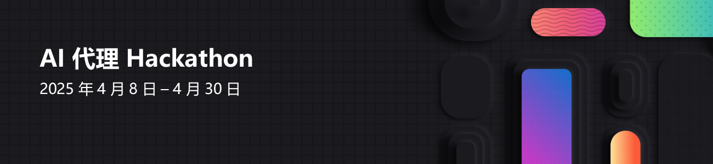

---
hide:
  - navigation
---

# 

🛠️ 构建、创新，#Hacktogether！ 🛠️

2025 是 AI 智能体的时代！但什么是智能体？又如何创建一个智能体呢？无论你是经验丰富的开发者还是初学者，这个为期三周的 **免费虚拟 Hackathon** 将是你深入了解 AI 智能体开发的绝佳机会。

🔥 观看 **20+ 场专家主导的直播课程**，涵盖 **Semantic Kernel**、**Autogen**、全新 **Azure AI Agents SDK** 和 **Microsoft 365 Agents SDK** 在内的顶尖框架。

💡 实践操作，释放创意，打造强大的 AI 智能体——然后提交你的作品，赢取**丰厚奖品！** 💸💡

!!! tip "**重要日期**"

    * 专家课程：**2025 年 4 月 8 日 – 2025 年 4 月 30 日**
    * Hackathon 提交截止日期：**太平洋时间 2025 年 4 月 30 日 23:59（北京时间 2025 年 5 月 1 日 14:59）**

不要错过——加入我们，共同构建 AI 的未来！ 🔥

若要获得更多的人工智能学习机会，请 [在 4 月 8 日与我们一起](https://aka.ms/aiskillsfest) 尝试冲击在 24 小时内“最多用户在线学习多层次人工智能课程”的吉尼斯世界纪录™称号。

## 注册 🎟️

[立即注册！](https://developer.microsoft.com/reactor/events/25323/) 填写表单即可注册参加 Hackathon。之后，浏览下面的直播时间表，并注册你感兴趣的课程。

注册完成后，[介绍一下自己](https://github.com/microsoft/AI_Agents_Hackathon/discussions/5)，并 [寻找队友](https://github.com/microsoft/AI_Agents_Hackathon/discussions/4)！

## 项目提交 🚀

请阅读 [官方规则](rules.md)，确保了解所有要求。

当您的项目准备好后，请按照 [提交流程](submission.md) 操作。📝

## 奖项与类别 🏅

项目将由评审团评估，包括 Microsoft 工程师、产品经理和开发者布道师。评审标准包括创新性、影响力、技术可用性以及与对应 Hackathon 类别的契合度。

以下类别的每个获胜团队将获得奖励。💸

* 最佳综合智能体 - 20,000 美元
* Python 最佳智能体 - 5,000 美元
* C# 最佳智能体 - 5,000 美元
* Java 最佳智能体 - 5,000 美元
* JavaScript/TypeScript 最佳智能体 - 5,000 美元
* 最佳 Copilot 智能体（使用 Microsoft Copilot Studio 或 Microsoft 365 Agents SDK） - 5,000 美元
* 最佳 Azure AI Agent Service 使用 - 5,000 美元

每个团队只能在一个类别中获奖。  
所有提交项目的参与者将获得一个数字徽章。

## 直播时间表 📅

### 中文

| 日期/时间 | 主题 | 专题 | 资源 |
| --------- | ---- | ---- | ---- |
| 4 月 8 日，时间待定 | 欢迎参加 AI 智能体 Hackathon | 所有 | - |
| 4 月 15 日，时间待定 | 使用 Azure AI Agent Service 作为您的软件开发流程 | 所有 | - |

### 其他语言

我们将提供超过 30 个英文直播，同时还会有西班牙语和葡萄牙语的直播。更多详情请查看 [主页](../index.md)。

## Office Hours 🕒

如果您需要更多帮助，可以在我们的 AI Discord 频道参加 Office Hours。

以下是目前安排的 Office Hours：

| 日期/时间 | 主题/主持人 |
| --------- | ---------- |
| 每周四，太平洋时间 12:30，北京时间次日 03:30 | [Python + AI（英语）](http://aka.ms/aipython/oh) |
| 每周一，太平洋时间 15：00，北京时间次日 06:00 | [Python + AI（西班牙语）](https://aka.ms/pythonia/oh) |

## 学习资源 📚

[访问资源！](https://aka.ms/AIAgent_Skilling)

加入 [TheSource EHub](https://aka.ms/thesource/ai_agents)，探索精选资源，包括培训、直播、代码库、技术指南、博客、下载、认证等，每月更新。其 AI 智能体部分提供创建 AI 智能体的关键资源，其他部分则涵盖 AI、开发工具和编程语言的见解。

您也可以在我们的 [讨论论坛](https://github.com/microsoft/AI_Agents_Hackathon/discussions) 中提问，或在 [Discord 频道](https://discord.gg/ZkEG5GYfGU) 与其他参与者交流。
